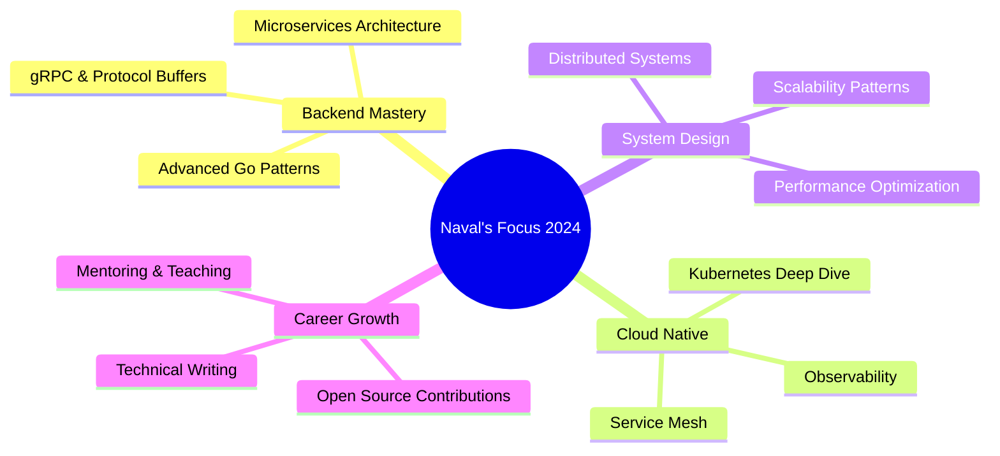

<div align="center">
  
</div>

<h1 align="center">
  
</h1>

<p align="center">
  <strong>Software Development Engineer</strong> • <strong>Go Developer</strong> • <strong>CS Student @ Bennett University</strong>
</p>

<p align="center">
  
  
  
</p>

<br/>

---

## 🚀 About Me


<div align="left">

```yaml
name: Naval Bihani
located_in: Bennett University, India
current_role: Software Development Engineer
education: Computer Science (CGPA: 9.3)

fields_of_interests:
  - Backend Development
  - Cloud Architecture
  - System Design
  - Competitive Programming
  
currently_learning:
  - Advanced Go Patterns
  - Kubernetes at Scale
  - Distributed Systems
  
hobbies:
  - Competitive Coding
  - Open Source
  - Tech Blogging
  - Fitness & Pickleball
```

</div>

<br clear="right"/>

### 💼 Professional Experience

- 💻 **Software Development Intern** @ Chirality Labs
  - Building scalable solutions with modern engineering practices
  - Implementing CI/CD pipelines and cloud infrastructure
  
- 🔧 **Go Developer** @ Phoenix Labs
  - Architecting backend services with clean architecture patterns
  - Achieved 35% improvement in API response times
  - Maintained 99.9% system uptime

- 📚 **DSA Instructor** @ University Level
  - Teaching algorithms and conducting coding workshops
  - Mentoring 100+ students in competitive programming

### 🏆 Key Achievements

<table align="center">
  <tr>
    <td align="center" width="25%">
      
      <br><strong>LeetCode Knight</strong>
      <br>1800+ Rating
      <br>800+ Problems
    </td>
    <td align="center" width="25%">
      
      <br><strong>Performance</strong>
      <br>35% Faster APIs
      <br>99.9% Uptime
    </td>
    <td align="center" width="25%">
      
      <br><strong>User Impact</strong>
      <br>1000+ Users
      <br>95% Satisfaction
    </td>
    <td align="center" width="25%">
      
      <br><strong>Optimization</strong>
      <br>40% Faster Loads
      <br>25% Faster Releases
    </td>
  </tr>
</table>

<br/>

---

## 🛠️ Tech Stack

<div align="center">

### Languages
<p>
  
  
  
  
  
  
  
</p>

### Frontend
<p>
  
  
  
  
  
</p>

### Backend
<p>
  
  
  
  
  
</p>

### Databases
<p>
  
  
  
  
  
  
</p>

### Cloud & DevOps
<p>
  
  
  
  
  
  
</p>

### Testing
<p>
  
  
  
</p>

</div>

<br/>

---

## 📊 GitHub Statistics

<div align="center">
  
  
</div>

<div align="center">
  
  
</div>

<div align="center">
  
</div>

<br/>

---

## 🔥 Featured Projects

<div align="center">

<table>
<tr>
<td width="50%" align="center">
  <h3>🎯 Hirees.com</h3>
  <p><strong>Job Platform with Advanced Search</strong></p>
  <p>AI-powered job matching system serving 1000+ active users</p>
  <p>
    
    
    
  </p>
  <p>⭐ <strong>95% Satisfaction Rate</strong></p>
</td>
<td width="50%" align="center">
  <h3>🧠 MindMesh</h3>
  <p><strong>AI Mind Mapping Tool</strong></p>
  <p>Real-time collaboration with AI-powered suggestions</p>
  <p>
    
    
    
  </p>
  <p>🔄 <strong>Real-time Sync</strong></p>
</td>
</tr>

<tr>
<td width="50%" align="center">
  <h3>📈 Virtual Venture</h3>
  <p><strong>Stock Simulation Platform</strong></p>
  <p>Live market data with 10K+ daily transactions</p>
  <p>
    
    
    
  </p>
  <p>💹 <strong>Live Market Data</strong></p>
</td>
<td width="50%" align="center">
  <h3>✉️ AI Email Assistant</h3>
  <p><strong>AI-Powered Email Replies</strong></p>
  <p>Context-aware AI generating 500+ daily emails</p>
  <p>
    
    
    
  </p>
  <p>🤖 <strong>92% Accuracy</strong></p>
</td>
</tr>

<tr>
<td width="50%" align="center">
  <h3>💬 DevFlow</h3>
  <p><strong>Developer Q&A Platform</strong></p>
  <p>Community-driven platform with 5000+ questions</p>
  <p>
    
    
    
  </p>
  <p>✅ <strong>85% Answer Accuracy</strong></p>
</td>
<td width="50%" align="center">
  <h3>🎨 UI Component Library</h3>
  <p><strong>Reusable Component System</strong></p>
  <p>50+ components for faster development</p>
  <p>
    
    
    
  </p>
  <p>⚡ <strong>60% Faster Development</strong></p>
</td>
</tr>
</table>

</div>

<br/>

---

## 💡 Experience Highlights

<div align="center">

| 🎯 Category | 📈 Achievement | 💪 Impact |
|:---:|:---|:---|
| **⚡ Performance** | Optimized API response times | **35% faster** with Golang services |
| **☁️ Reliability** | Achieved production uptime | **99.9% availability** |
| **🚀 Speed** | Reduced page load times | **40% faster** through optimization |
| **📦 Deployment** | Containerized applications | **25% faster** release cycles |
| **💾 Database** | Optimized queries | **40% faster** execution time |
| **👥 User Impact** | Built platforms serving | **1000+ active users** |
| **⭐ Satisfaction** | User satisfaction rate | **95% positive** feedback |
| **📊 Processing** | RESTful API development | **15% faster** processing |

</div>

<br/>

---

## 🏆 Coding Profiles & Achievements

<div align="center">

<table>
<tr>
<td align="center" width="33%">
  
  <br><br>
  <a href="https://leetcode.com/u/navalbihani15">
    
  </a>
  <br><br>
  <strong>Knight Badge 🏆</strong>
  <br>1800+ Rating
  <br>800+ Problems Solved
  <br>Top 5% Globally
</td>
<td align="center" width="33%">
  
  <br><br>
  <a href="https://auth.geeksforgeeks.org/user/navalbihani15">
    
  </a>
  <br><br>
  <strong>Active Contributor</strong>
  <br>800+ Problems
  <br>Specialization: DP, Graphs
  <br>System Design Expert
</td>
<td align="center" width="33%">
  
  <br><br>
  
  <br><br>
  <strong>Tech Lead & Mentor</strong>
  <br>150+ Students Led
  <br>15+ Hackathons Organized
  <br>60% Engagement Boost
</td>
</tr>
</table>

</div>

<br/>

---

## 👥 Leadership & Community Impact

<div align="center">

<table>
<tr>
<td align="center" width="50%">
  <h3>🎯 Alan Turing Club - Tech Lead</h3>
  <p>Leading technical initiatives and organizing events</p>
  <ul align="left">
    <li>✅ Organized <strong>15+ hackathons</strong></li>
    <li>✅ Engaged <strong>200+ students</strong></li>
    <li>✅ Increased participation by <strong>85%</strong></li>
    <li>✅ Conducted coding workshops & bootcamps</li>
  </ul>
</td>
<td align="center" width="50%">
  <h3>☁️ Cloud Computing Co-Head</h3>
  <p>Driving cloud technology adoption and education</p>
  <ul align="left">
    <li>✅ Led workshops improving engagement by <strong>60%</strong></li>
    <li>✅ Partnered with <strong>3 cloud providers</strong></li>
    <li>✅ Managed team of <strong>150+ students</strong></li>
    <li>✅ Organized cloud certification programs</li>
  </ul>
</td>
</tr>
<tr>
<td align="center" width="50%">
  <h3>🎓 Placement Cell Member</h3>
  <p>Supporting students in career development</p>
  <ul align="left">
    <li>✅ Assisted peers with interview preparation</li>
    <li>✅ Conducted mock interviews & resume reviews</li>
    <li>✅ Career guidance and mentorship sessions</li>
    <li>✅ Shared industry insights and trends</li>
  </ul>
</td>
<td align="center" width="50%">
  <h3>💻 Tech Mentor & Community Builder</h3>
  <p>Active contributor to tech community</p>
  <ul align="left">
    <li>✅ Mentoring junior developers</li>
    <li>✅ Contributing to open source projects</li>
    <li>✅ Writing technical blog posts</li>
    <li>✅ Fitness enthusiast & pickleball player</li>
  </ul>
</td>
</tr>
</table>

</div>

<br/>

---

## 📫 Connect With Me

<div align="center">

<a href="https://linkedin.com/in/navalbihani15">
  
</a>
<a href="https://github.com/Naval1525">
  
</a>
<a href="mailto:navalbihani15@gmail.com">
  
</a>
<a href="https://leetcode.com/u/navalbihani15">
  
</a>

<br/><br/>

### 💼 Open For

<table>
<tr>
<td align="center" width="25%">
  
  <br><strong>Full-time Roles</strong>
  <br>Software Development
</td>
<td align="center" width="25%">
  
  <br><strong>Collaboration</strong>
  <br>Open Source Projects
</td>
<td align="center" width="25%">
  
  <br><strong>Freelance</strong>
  <br>Projects & Consulting
</td>
<td align="center" width="25%">
  
  <br><strong>Speaking</strong>
  <br>Tech Talks & Mentoring
</td>
</tr>
</table>

</div>

<br/>

---

## 💭 Random Dev Quote

<div align="center">


</div>

<br/>

---

## 🎯 Current Focus

<div align="center">



</div>

<br/>

---

<div align="center">

### ⚡ Fun Fact

*"Clean code always looks like it was written by someone who cares"* - Robert C. Martin

<br/>

---


<br/>

**Thanks for visiting! Let's build something amazing together! 🚀**

<br/>


</div>
